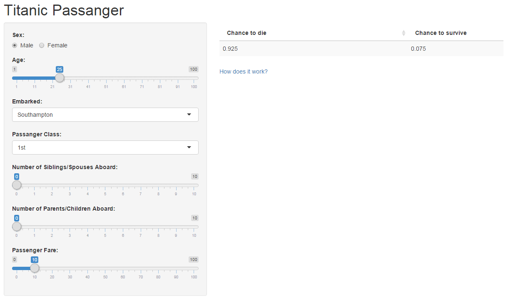

## About Project

Application predicts chance to survive onboard Titanic by passanger data.

Used dataset from Kaggle's <a href="http://www.kaggle.com/c/titanic", target="_blank">"Titanic: Machine Learning from Disaster"</a> competition.

For predicting was taken 7 variables from dataset, and builted random forest model

Model has about 0.77 accuracy amd used only for demonstration purpouse

Model saved to a file and used in server.ui part of shiny application.

---

## Male Data by Pclass
For some explaratory analysis take a look at "Survived"" vs "Passanger class"" chart by Male subset

(Dark colors for "Died", Bright for "Survived")
```{r echo = F, results = 'asis'}
require(rCharts)
Titanic<-read.csv("train.csv", na.strings=c("","NA"))
Titanic$Sex <- as.factor(Titanic$Sex)
Titanic$Pclass <- as.factor(Titanic$Pclass)
Titanic$Survived <- as.factor(Titanic$Survived)
levels(Titanic$Survived) <- c("Died","Survived")
levels(Titanic$Sex) <- c("female", "male")
n1 <- nPlot(~Pclass,  group= 'Survived', type = 'pieChart',
  data = subset(Titanic, Sex == 'male'))
n1$print('chart1')
```

---

## Female Data by Pclass
And for Female (Dark colors for "Died", Bright for "Survived")

```{r echo = F, results = 'asis'}
n2 <- nPlot(~Pclass,  group= 'Survived', type = 'pieChart',
  data = subset(Titanic, Sex == 'female', id = 'chart2'))
n2$print('chart2')

```

---

## Interface of app



---

## The End

Link to app <a href = "https://dddbbb.shinyapps.io/Titanic" target="_blank">Link to app</a>

Thank you!
